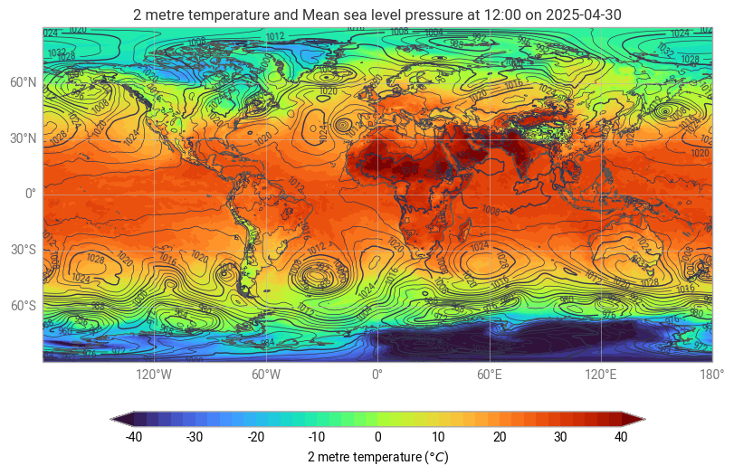
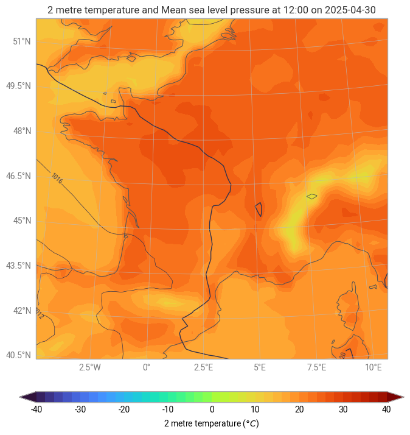

EarthReach documentation
========================

|Python 3.12| |License: Apache 2.0|

.. |Python 3.12| image:: https://img.shields.io/badge/python-3.12-blue.svg
   :target: https://www.python.org/downloads/release/python-3120/

.. |License: Apache 2.0| image:: https://img.shields.io/badge/License-Apache%202.0-blue.svg
   :target: https://opensource.org/licenses/apache-2-0

EarthReach is a Python library for generating natural language descriptions of meteorological data visualizations. The library extends **earthkit-plots** by providing automated text generation capabilities for weather charts, enabling programmatic conversion of visual data representations into structured textual descriptions.

The system implements a dual-LLM architecture consisting of a generator agent and an evaluator agent. The generator creates initial descriptions from chart images and associated GRIB file metadata, while the evaluator assesses output quality across multiple criteria including scientific accuracy, coherence, and meteorological relevance. This iterative process continues until quality thresholds are met or maximum iterations are reached.

Supported Chart Types
---------------------

EarthReach supports two primary types of weather charts, both requiring temperature and pressure data overlays:

**Global Charts**

Global-scale meteorological visualizations showing worldwide weather patterns, typically displaying temperature and pressure fields across continental and oceanic regions.

**Regional Charts**

Regional-scale meteorological visualizations focusing on specific geographical areas, providing temperature and pressure analysis for localized weather systems.

.. note::
   The current system is optimized for global charts. But as regional charts are more commonly encountered in practice, future development should focus on improving regional chart analysis quality.

.. toctree::
   :maxdepth: 2
   :caption: Contents:

   installation
   usage
   api
